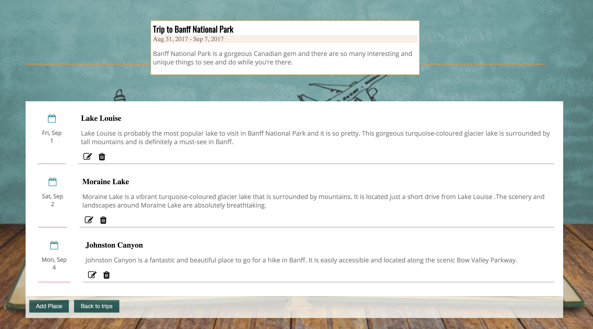

# Trip Journal
Trip journal is an app that allows users to document their travel experiences. 

## Technology Used

### Front End
- HTML5
- CSS3
- JavaScript
- jQuery

### Back End
- Node.js
- Express
- Mongoose
- MongoDB

### Testing and Deployment
- Mocha
- Chai
- Travis CI
- Heroku
- mLab

### Responsive
- The app is responsive and optimized for both desktop and mobile viewing and use.

### Security
- User passwords are encrypted using bcrypt.js

## Screenshots

